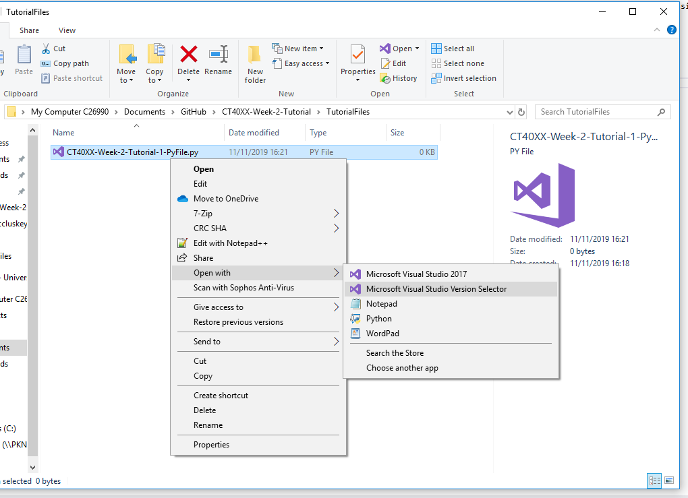
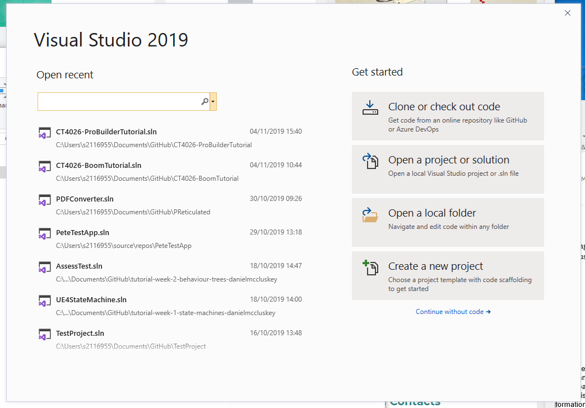
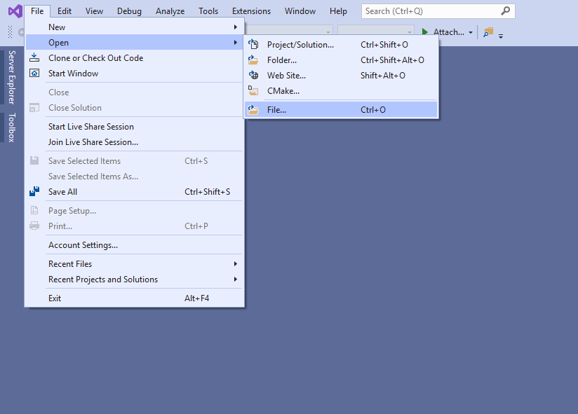
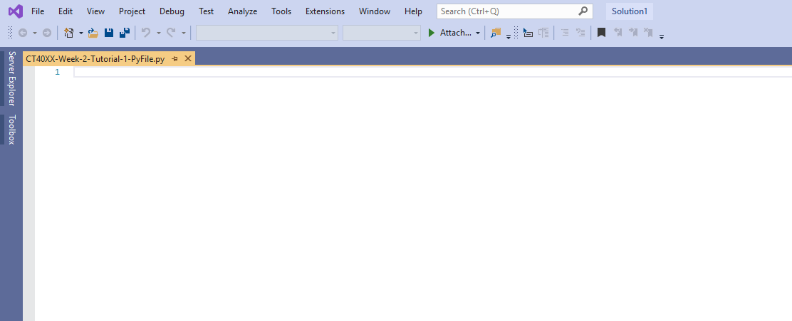

# What is a `.py` file?
A `.py` file is a script file that contains Python code, which can be ran on the command line or can be used to store information or create Python packages (Which we will learn about in later sessions).

# Opening a `.py ` file in Visual Studio 2019
The University computers have Visual Studio 2019 installed on them by default, but they might not have the necessary Python Packages. You may need to install the Anaconda Distribution again if it is not on your computer (We did this in the Week-1 tutorials!).


#### Opening from the Windows Explorer
To open a `.py` file in Visual Studio 2019, you just have to simply right click the file, hover over `Open With >` and select `Visual Studio 2019` from the list. However, if `Visual Studio 2019` is not on your Open with list, you can select `Visual Studio Version Selector` or `Choose another app` to find it there instead.



#### Opening from Visual Studio 2019
Alternatively you can open `.py` files directly from Visual Studio very easily, first open up Visual Studio.

Then click `Use without code` near the bottom right of the pop-up window.



You can then go to `File > Open > Open File` and browse for the `.py` file that you wish to open.



Browse to where you saved this directory (`Documents/GitHub` is the default location.) and open the `.py` file in the `TutorialFiles` folder. Once done you should be met with an empty docment similar to the following image.



# Writing our Python code
In this document you are free to write Python code, when the `.py` file is ran the code inside of it will be ran from top to bottom.

For now, we're going to write a simple program that asks for our name and then says "Hello NAME" (Like the one from the first weeks tutorial!)

Try and do this by yourself! Practice makes perfect, but if you get stuck the code is in the drop down section below.


# Running our Python code
To run our code, we're are going to need a Python Interpreter to run it from. For this, we are going to use the Anaconda Prompt that was installed when you installed the Anaconda Distribution.

To open the Anaconda Prompt, just simply search for it in the Windows Start menu and click on it.

When it opens, you will need to navigate to where your `.py` file is located. On the command line we can do this using the `cd` command (Change Directory). My `.py` file is located in my GitHub repository in my documents folder so I need to type:

```bash
cd C:\Users\USERNAME\Documents\GitHub\CT40XX-Week-2-Tutorial\TutorialFiles
```
or since when opened, the Anaconda Prompt defaults to the users home directory, I could do a series of commands one after another like so:
```bash
cd Documents
cd GitHub
cd CT40XX-Week-2-Tutorial
cd TutorialFiles
```

Once we have reached that directory, we can execute our Python code! We can either use `py` or `python` to run the file like so:
```bash
py CT40XX-Week-2-Tutorial-1-PyFile.py
```
or
```bash
python CT40XX-Week-2-Tutorial-1-PyFile.py
```

Running either of these will execute our `.py` file!

# Creating your own `.py` file
Move onto the next tutorial which will qucikly go over how to create your own `.py` file.