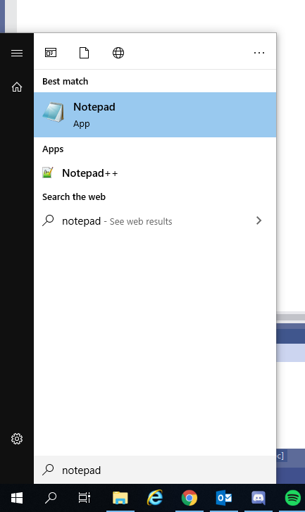
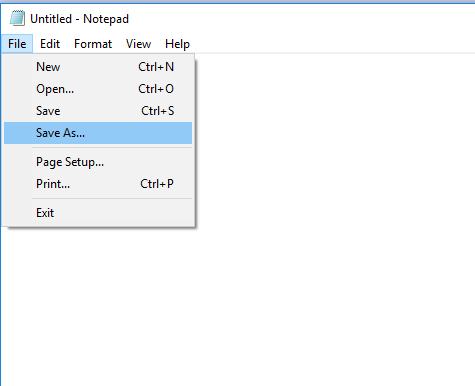
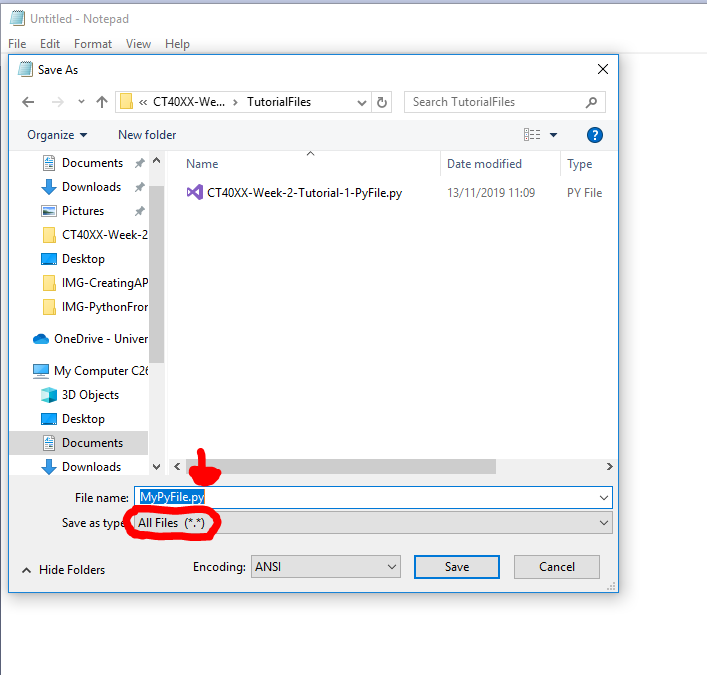
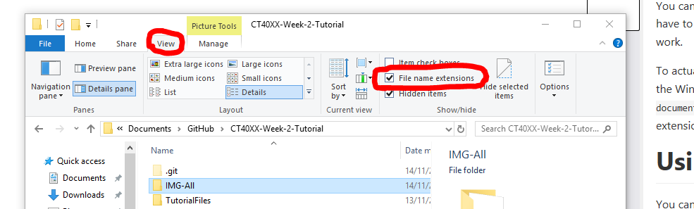
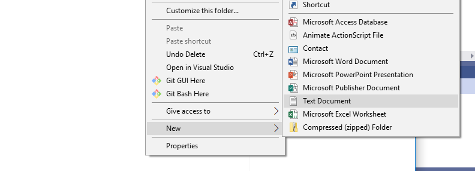
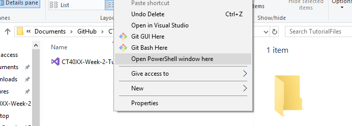
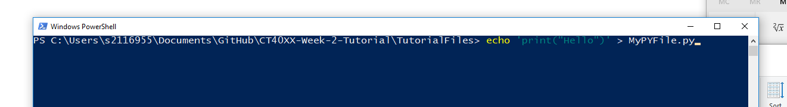

# Creating a `.py` file
There are multiple ways to create a `.py` file. This tutorial will cover a few ways on how to do so.

# Using Notepad
Using the Notepad program that comes bundled with Windows, you can open this by finding it in the Windows Start Menu. 



Using this, we can easily create `.py` files. Do this by going to `File` at the top of the screen and clicking `Save as...`.



In the popup window, we can then select `All Files` as the file type for the file and for the name we just have to add `".py"` at the end.



Click `Save` to save your `.py` file!


# Using the Windows File Explorer
You can also create them directly from the Windows File Explorer. You will have to check the `File Extensions` checkbox under the view tab for this to work.



To actually create the file you will need to right click on any empty space in the Windows File Explorer, then hover over `New` and click `New Text document`. When prompted to name the new document, change the file extension from `.txt` to `.py`.



# Using the Command Line
You can also use the command line to create files, the easiest method is the following:

Hold <kbd>Shift</kbd> + <kbd>Right Click</kbd> in any empty space in the Windows File Explorer to open an options prompt with extra options.



Click on `Open PowerShell window here` to open a Command line instance in this directory.



When opened, type the following command to generate your `.py` file:

```bash
echo 'print("Hello!")' > MyPYFile.py
```

A quick breakdown of what that command does:
- `echo`: The command.
- `'print("Hello!")'`: The text we wish to place inside our new file, can be left blank to produce an empty file.
- `>`: Indicates that we wish to `echo` this text into a file.
- `MyPYFile.py`: The file which we want to add the text to, will create the file if it doesn't already exist.

Once you run the command, your `.py` file will be created!