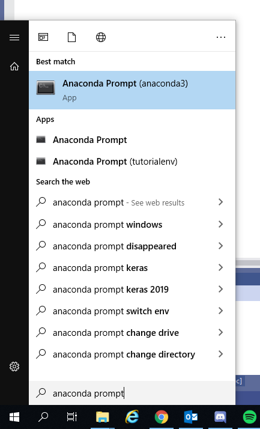
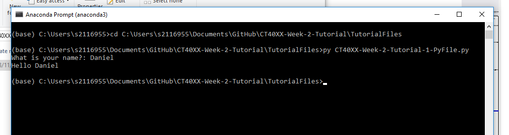

# Running our Python code
This section will quickly go over how to run the Python file we opened in the last tutorial.

To run our code, we're are going to need a Python Interpreter to run it from. For this, we are going to use the Anaconda Prompt that was installed when you installed the Anaconda Distribution.

To open the Anaconda Prompt, just simply search for it in the Windows Start menu and click on it.



When it opens, you will need to navigate to where your `.py` file is located. On the command line we can do this using the `cd` command (Change Directory). My `.py` file is located in my GitHub repository in my documents folder so I need to type:

```bash
cd C:\Users\USERNAME\Documents\GitHub\CT40XX-Week-2-Tutorial\TutorialFiles
```
or since when opened, the Anaconda Prompt defaults to the users home directory, I could do a series of commands one after another like so:
```bash
cd Documents
cd GitHub
cd CT40XX-Week-2-Tutorial
cd TutorialFiles
```

Once we have reached that directory, we can execute our Python code! We can either use `py` or `python` to run the file like so:
```bash
py CT40XX-Week-2-Tutorial-1-PyFile.py
```
or
```bash
python CT40XX-Week-2-Tutorial-1-PyFile.py
```

Running either of these will execute our `.py` file!



# Creating your own `.py` file
Move onto the next tutorial which will quickly go over how to create your own `.py` file.