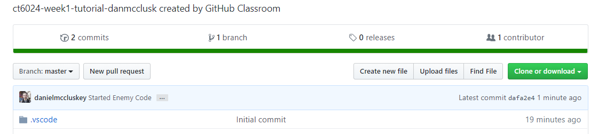

# CT40XX - Week 2 - Tutorial #5
This tutorial will show you how to push and save your work to GitHub.

## Committing your changes
It is a good idea to make regular commits so that you can save your work at different intervals, allowing you to revert to them if you make a mistake. So once you have made some changes, save your work and head back to GitHub Desktop.
Once it has refreshed you will see that your changes appear on the Changelist and that you can see the changes to each file.

If you do not wish to commit a file, you can either un-check it from the File changelist or Right click it and Ignore the file.

## 
When committing, you should make sure that your Commit summary and desctription actually tell you what changes you have made. This is good practice for work in the industry and also helps you find a commit if you ever need to revert. 
Some examples of **Bad** summaries would be `asdafdfsdsdcds` or `Fixed the Thing`. 

## 
Once you are happy with your commit description, you can go ahead and click `Commit to Master`. Once you have committed, you will need to `Push` that commit to GitHub, you can do this by clicking the `Push Origin` button at the top of the window.

## Checking it worked
You can check if your work was successfully uploaded by going to your repository in your preferred browser and checking the commit history, in the image below, you can see that the latest commit was the one we just pushed!

